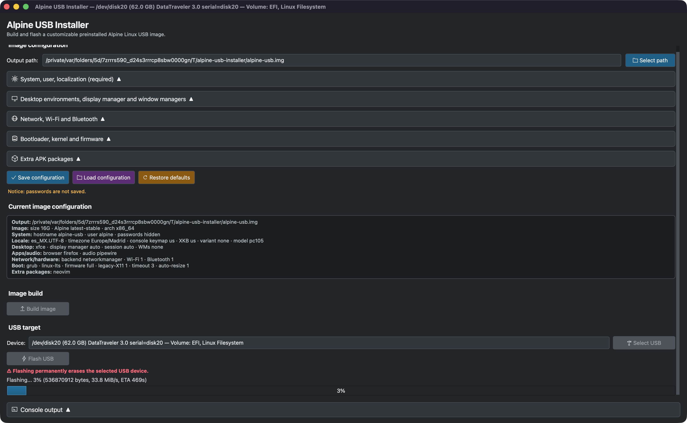

# Linux USB Installer

Build and flash configurable, preinstalled **Alpine Linux and RHEL-family (Rocky/Alma/CentOS Stream/RHEL-like) x86_64 USB images** from a Qt GUI or one unified terminal binary (TUI + CLI commands). Alpine remains the default backend; Rocky Linux 9 is the default RHEL-family target when `--distro rhel`/`rocky` is selected.

> License: GPL-2.0-only. See [`LICENSE`](LICENSE).

## Contents

- [Features](#features)
- [Requirements](#requirements)
- [Quick start](#quick-start)
- [Interfaces](#interfaces)
  - [GUI](#gui)
  - [TUI](#tui)
  - [CLI](#cli)
- [Build profiles](#build-profiles)
- [Configuration guide](#configuration-guide)
- [Write to USB](#write-to-usb)
- [Booting the USB](#booting-the-usb)
  - [Intel Macs](#intel-macs)
  - [x86 PCs](#x86-pcs)
- [Initial login](#initial-login)
- [macOS DMG packaging](#macos-dmg-packaging)
- [Validation and tests](#validation-and-tests)
- [Troubleshooting](#troubleshooting)
- [License](#license)

## Features

- Build a bootable, installed Alpine Linux USB image, or a RHEL-family image foundation using `dnf --installroot` (Rocky Linux 9 default).
- Configure desktop/session options:
  - XFCE, GNOME, KDE Plasma, MATE, LXQt, or no full desktop.
  - Optional i3, Sway, Hyprland, AwesomeWM, bspwm, Openbox, labwc.
- Configure bootloader, kernel, firmware, keyboard, locale, users, Wi‑Fi, Bluetooth, audio, browser, and extra distro packages.
- Search official Alpine `main` + `community` packages and RHEL-family packages through `dnf repoquery` when available.
- Cache package indexes/searches on disk for fast repeated searches.
- Build a compatibility-oriented default image or a smaller minimal image.
- Toggle broad legacy X11 video drivers for compatibility vs smaller/faster graphical images.
- Flash generated images to USB from macOS/Linux with whole-disk safety checks and raw-image integrity validation before writing.
- Auto-expand the root filesystem on first boot to use the full USB drive.
- Run compile/lint/test/smoke validation with one project check command.

## Requirements

### Build host

- Python 3.
- Docker Desktop on macOS. The build needs Linux/NBD support.
  - First macOS build creates a cached `alpine-usb-builder:3.22-amd64` Docker image so later builds skip reinstalling build tools.
  - Set `ALPINE_USB_SKIP_BUILDER_CACHE=1` to force the fresh-container path.
  - Set `ALPINE_USB_REBUILD_BUILDER=1` to rebuild the cached builder image.
- On native Linux: `mtools`, GRUB EFI tooling, `qemu-nbd`, `parted`, `rsync`, `dosfstools`, and normal image build tools.

### Runtime tools

- macOS flashing: `diskutil`, `dd`, administrator password.
- Linux flashing: `lsblk`, `dd`, `sudo` or `pkexec`.
- Windows raw flashing is not implemented here. Use Rufus or balenaEtcher with the generated image.

## Quick start

```sh
# GUI
./gui.py

# Unified terminal binary: TUI by default
./alpine-usb

# Explicit TUI
./alpine-usb tui

# CLI help/subcommands
./alpine-usb --help
./alpine-usb build --help

# RHEL-family dry-run (Rocky Linux 9 default mapping)
./alpine-usb build --distro rocky --release 9 --dry-run --password 'change-me'
```

Default output path:

```txt
/tmp/alpine-usb-installer/linux-usb.img
```

## Interfaces

### GUI

```sh
./gui.py
```




`./gui.py` creates and uses its own `.qtvenv` automatically if PySide6 is missing. The dev GUI installs the minimal Qt runtime declared in `requirements.txt`.

GUI flow:

1. Set image output path.
2. Open only the configuration sections you want to change.
3. Review the live configuration summary.
4. Build the image. During a build, the form stays editable for the next profile and the build can be stopped/cleaned.
5. Select USB target.
6. Flash USB. The image is checked before flashing to avoid writing incomplete or corrupt builds.

GUI image configurations auto-save as you edit and can also be saved/loaded as JSON (`.json`) or YAML (`.yaml`/`.yml`). Saved files never include user/root passwords. Password fields stay in memory while the app is open, including when loading another configuration file or restoring defaults. After restarting the app, enter the user password again before building. By default, root password mirrors the user password; enable “Use separate root password” only when you want different credentials. The live configuration summary updates immediately, and loaded/changed fields stay marked with dirty dots until you explicitly save them.

USB selection shows the full device label, size, model, serial/id, and volume info when available. Internally, flashing strips that label down to the safe whole-disk device path, for example `/dev/disk20`.

If USB auto-detection fails, type the whole-disk device manually, for example `/dev/disk7` on macOS or `/dev/sdb` on Linux.

### TUI

```sh
./alpine-usb
# or explicit:
./alpine-usb tui
```

The TUI provides full-screen menus for configuration, package search, dry-run/build, USB device selection, flashing, and host diagnostics. There is one terminal entrypoint, `alpine-usb`; `cli.py` and `tui.py` are import-only support modules.

### CLI

```sh
./alpine-usb --help
./alpine-usb build --help
```

Common commands:

```sh
# Search packages
./alpine-usb search firefox

# Validate a profile without building
./alpine-usb build --dry-run --ask-password --desktop xfce --bootloader systemd-boot

# Build default profile without prompts (avoid shell history by using --ask-password instead)
./alpine-usb build --password 'change-me' -y

# Build Plasma profile
./alpine-usb build --ask-password --desktop plasma --display-manager sddm --bootloader systemd-boot -y

# Build smaller/faster minimal profile defaults
./alpine-usb build --ask-password --profile minimal -y

# Build graphical image without broad legacy X11 drivers
./alpine-usb build --ask-password --desktop xfce --no-legacy-x11-drivers -y

# List removable devices
./alpine-usb devices

# Flash image to USB
./alpine-usb flash /tmp/alpine-usb-installer/linux-usb.img /dev/sdX
```

Flash refuses partitions, non-removable/non-hotplug disks, missing images, truncated images, corrupt GPT images, and images without the expected EFI + Linux root partitions. Confirmation shows target model, size, serial/id, and device path before writing.

Extra packages can be repeated or space-separated:

```sh
./alpine-usb build --ask-password \
  --extra-package neovim \
  --extra-package "tmux htop" \
  --extra-package docker
```

## Build profiles

### Default compatibility profile

Defaults are generic and distro-like:

| Option | Default |
| --- | --- |
| Image size | `16G` |
| Output | `/tmp/alpine-usb-installer/linux-usb.img` |
| Distro | `alpine`; use `--distro rocky`/`alma`/`centos-stream` for RHEL-family |
| Alpine branch | `latest-stable` |
| RHEL-family release | `9` |
| Architecture | `x86_64` |
| User/password | user `alpine` / password required before build |
| Root password | same as user password unless configured separately |
| Locale/timezone | `en_US.UTF-8` / `UTC` |
| Keyboard | US console + XKB |
| Desktop | XFCE |
| Display manager | auto recommended, usually LightDM for XFCE/MATE |
| Bootloader | GRUB removable UEFI |
| Kernel | `linux-lts` |
| Firmware | full firmware |
| X11 drivers | broad legacy driver set enabled |
| Network | NetworkManager + Wi‑Fi |
| Bluetooth | enabled |
| Audio | PipeWire + WirePlumber + pipewire-pulse |
| Browser | Firefox |
| USB auto-resize | enabled |

### Minimal profile

`--profile minimal` changes defaults for smaller/faster images:

| Option | Minimal default |
| --- | --- |
| Desktop | none |
| Display manager | none |
| Browser | none |
| Audio | none |
| Network | none |
| Wi‑Fi | disabled |
| Bluetooth | disabled |
| Firmware | `linux-firmware-none` |
| Legacy X11 drivers | disabled |

Explicit CLI options override profile defaults. Example: `--profile minimal --desktop xfce --wifi` keeps XFCE and Wi‑Fi while using other minimal defaults.

### RHEL-family backend status

The CLI/TUI expose `--distro rhel|rocky|alma|centos-stream` with release `9` as the documented default. The RHEL-family backend validates the same high-level profile, desktop/session, user, localization, network, firmware, browser, audio, extra package, dry-run, package mapping, and package-search concepts as Alpine where packages exist in common RHEL/EPEL-style repositories. The real build path is `build-rhel-usb.sh`, a Linux-host `dnf --installroot` raw-image flow with GRUB removable UEFI and first-boot root resize. Current gaps are explicit: macOS RHEL image builds require a Linux VM/container with loop/NBD support; systemd-boot and several Alpine-only WMs (Hyprland, AwesomeWM, bspwm, labwc) are rejected for RHEL-family until repository support is mapped.

## Configuration guide

### System, user, localization

Configure image size, distro (`alpine` by default, or RHEL-family), Alpine branch/RHEL release, hostname, username/passwords, timezone, locale, console keymap, and XKB layout.

### Desktop/session

Choose a desktop, display manager, default session, browser, audio backend, and optional window managers.

Recommended compatibility:

- Older hardware: XFCE + LightDM + GRUB + `linux-lts` + full firmware.
- Modern KDE setup: Plasma + SDDM.
- GNOME setup: GNOME + GDM.
- WM-only setup: no desktop + greetd or no display manager.
- Wayland sessions such as Sway/Hyprland/labwc: use Auto, greetd, SDDM, GDM, or no display manager. LightDM/LXDM are treated as X11-only here.

### Network, Wi‑Fi, Bluetooth

NetworkManager is recommended for desktop usage. Bluetooth uses `obexd-enhanced` to avoid conflicts with GNOME Bluetooth while still providing OBEX support.

### Audio

PipeWire is the recommended default. On Alpine/OpenRC there is no `systemd --user` manager, so the generated desktop image starts `pipewire`, `wireplumber`, and `pipewire-pulse` from XDG autostart.

### Bootloader, kernel, firmware

- GRUB removable UEFI is the safest default across many PCs and Intel Macs.
- systemd-boot removable UEFI is available for UEFI-focused systems.
- `linux-lts` is recommended for stability.
- Full firmware is recommended for laptops and Wi‑Fi/Bluetooth hardware.
- Disable broad legacy X11 video drivers (`--no-legacy-x11-drivers`) for smaller/faster graphical images on modern hardware.

### Extra APK packages

Use official Alpine package names. Package search queries Alpine `main` and `community` indexes.

Search results are cached on disk under:

```txt
${XDG_CACHE_HOME:-~/.cache}/alpine-usb-installer/apkindex
```

Cache controls:

```sh
# Disable cache for one command
ALPINE_USB_APK_CACHE=0 ./alpine-usb search firefox

# Use custom cache dir
ALPINE_USB_APK_CACHE_DIR=/tmp/alpine-apk-cache ./alpine-usb search firefox

# Override TTL in seconds
ALPINE_USB_APK_CACHE_TTL=3600 ./alpine-usb search firefox
```

If network fetch fails and a stale cache exists, search uses the stale cache instead of failing.

## Write to USB

> Warning: flashing completely erases the selected device.

Use the whole disk (`/dev/sdX`, `/dev/diskX`), not a partition (`/dev/sdX1`, `/dev/diskXs1`). Do not copy `alpine-usb.img` as a file onto a FAT/exFAT USB; write it raw to the whole device.

### macOS

```sh
diskutil list
diskutil unmountDisk /dev/diskX
sudo dd if=/tmp/alpine-usb-installer/alpine-usb.img of=/dev/rdiskX bs=16m status=progress
sync
diskutil eject /dev/diskX
```

### Linux

```sh
lsblk
sudo dd if=/tmp/alpine-usb-installer/alpine-usb.img of=/dev/sdX bs=16M iflag=fullblock status=progress conv=fsync
sync
```

## Booting the USB

General flow:

1. Shut down target computer.
2. Insert flashed USB drive.
3. Open one-time boot menu during power-on.
4. Choose USB drive.
5. If both `UEFI: <usb>` and non-UEFI USB entries exist:
   - Modern machines: try `UEFI: <usb>` first.
   - Older BIOS/CSM machines: try non-UEFI `USB Hard Drive` first.

Firmware settings if boot fails:

- Enable USB boot.
- Disable Secure Boot unless your firmware accepts this image.
- Disable Fast Boot if USB is skipped.
- For older systems, enable Legacy Support / CSM / Legacy Boot.
- Move USB above internal disk in boot order, or use one-time boot menu.
- Try another USB port, especially USB 2.0 on older machines.
- Reflash raw to whole disk if USB does not appear.

Common keys:

| Vendor | Boot menu | BIOS/Setup |
| --- | --- | --- |
| HP | `Esc` then `F9` | `Esc` then `F10` |
| Dell | `F12` | `F2` |
| Lenovo ThinkPad | `F12` | `F1` |
| Lenovo IdeaPad | `F12` or Novo button | `F2` or Novo button |
| Acer | `F12` | `F2` |
| ASUS | `Esc` | `F2` or `Del` |
| MSI | `F11` | `Del` |
| Gigabyte | `F12` | `Del` |
| Intel NUC | `F10` | `F2` |
| Apple Intel Mac | hold `Option` / `Alt` | Recovery / Startup Security Utility for T2 |

### Intel Macs

Intel Macs can boot the generated `x86_64` image. Apple Silicon Macs can build and flash it, but cannot boot this x86_64 Alpine image natively.

Recommended Intel Mac profile:

- `Arch`: `x86_64`
- `Bootloader`: GRUB
- `Kernel`: `linux-lts`
- `Firmware`: full firmware enabled
- `Desktop`: XFCE
- `Display manager`: LightDM
- `Network`: NetworkManager
- `Wi‑Fi`: enabled
- `Bluetooth`: enabled
- `Auto-resize USB`: enabled

Boot:

1. Shut down Mac.
2. Insert flashed USB drive.
3. Power on while holding `Option` / `Alt`.
4. Choose `EFI Boot` or the orange USB icon.

If USB does not appear:

- Try another USB port.
- Try a simple USB 2.0 hub on older Macs.
- Reflash raw to whole disk.
- Use GRUB instead of systemd-boot.
- On T2 Intel Macs, allow external boot.

T2 setup:

1. Boot macOS Recovery with `Cmd` + `R`.
2. Open `Utilities` → `Startup Security Utility`.
3. Set `Secure Boot` to `No Security` if needed.
4. Set `External Boot` to `Allow booting from external media`.
5. Reboot while holding `Option` / `Alt`.

### x86 PCs

Use this section for most Intel/AMD desktops and laptops, including older BIOS/UEFI hybrid systems.

Recommended broad-compatibility profile:

- XFCE
- LightDM
- GRUB removable UEFI
- `linux-lts`
- Full firmware
- Broad legacy X11 drivers enabled
- NetworkManager + Wi‑Fi
- Bluetooth enabled when needed
- Auto-resize enabled

Recommended modern/minimal profile:

- GRUB or systemd-boot for UEFI-only machines
- `linux-lts` for stability, `linux-stable` if you need newer hardware support
- Disable broad legacy X11 drivers on modern GPUs if you want a smaller image
- Use `--profile minimal` for server/rescue/TTY-only USBs

BIOS/UEFI setup:

1. Open one-time boot menu or firmware setup.
2. Enable USB boot.
3. Disable Secure Boot if the image is blocked.
4. Disable Fast Boot if USB devices are skipped during startup.
5. On older machines, enable Legacy Support / CSM if UEFI boot fails.
6. Move USB above internal disk in boot order, or use the one-time boot menu.
7. Try `UEFI: USB` first on modern systems.
8. Try non-UEFI `USB Hard Drive` first on older BIOS/CSM systems.
9. If boot fails, try another USB port, a USB 2.0 port/hub, GRUB bootloader, and full firmware.

## Initial login

Defaults unless changed:

```txt
user: alpine
password: the password entered before build
root password: same as user password unless configured separately
```

Saved GUI profiles/configuration files do not persist these passwords; enter the user password again before each build after restarting the GUI. Loading a saved file does not clear passwords already entered in the current GUI session. CLI builds require `--ask-password` or `--password`; TUI builds require filling the user password field. By default, root password mirrors the user password; enable “Use separate root password” in GUI, fill root password in TUI, or pass `--root-password` in CLI only when you want different credentials.

Change passwords after first boot:

```sh
passwd
sudo passwd root
```

## macOS DMG packaging

Build a DMG on macOS with:

```sh
scripts/build-macos-dmg.sh
```

Build all release assets with:

```sh
scripts/package-release-assets.sh 0.1.16
```

The release packager creates separate GUI and terminal assets:

- `alpine-usb-installer-<version>-macos-arm64-gui.dmg` contains only `Alpine USB Installer.app`.
- `alpine-usb-installer-<version>-macos-arm64-terminal.tar.gz` contains only the standalone `alpine-usb` terminal binary.

The terminal binary is shipped as `.tar.gz` because raw GitHub asset downloads do not preserve Unix executable bits. The terminal binary carries the build resources it needs and copies them to `/tmp/alpine-usb-installer/terminal-runtime` before invoking build scripts.

## Validation and tests

Full project compile/lint/test/smoke check:

```sh
scripts/check-project.sh
```

Unit tests and linter:

```sh
pytest
ruff check .
ruff format --check .
```

Unified terminal smoke tests:

```sh
scripts/test-cli.sh
```

Image-configuration compile check for Python modules, build/config shell scripts, and real Alpine/RHEL-family CLI dry-runs:

```sh
scripts/check-image-compile.sh
```

Dry-run option matrix (parallel by default; override with `JOBS=4`):

```sh
scripts/validate-config-matrix.sh
```

Check representative profiles with Alpine APK dependency solver inside Docker:

```sh
scripts/check-apk-solver.sh
```

## Troubleshooting

### GUI does not start

- Run from the project root with `./gui.py`.
- If `.qtvenv` is stale, remove it and relaunch:

```sh
rm -rf .qtvenv
./gui.py
```

### USB does not boot

- Confirm image was flashed raw to the whole disk.
- Try GRUB bootloader.
- Disable Secure Boot.
- Try both UEFI and legacy USB boot entries.
- Try another USB port.
- Rebuild with full firmware.
- For older PCs, enable CSM/Legacy Support.

### No Wi‑Fi or Bluetooth

- Use full firmware.
- Enable Wi‑Fi/Bluetooth toggles.
- Prefer NetworkManager for desktops.
- Check device support in Alpine for that chipset.

### No desktop audio control

- Use PipeWire audio.
- Rebuild with current image: generated desktops autostart PipeWire session components under OpenRC/elogind.
- Check logs after boot:

```sh
ls /tmp/alpine-usb-*pipewire*.log /tmp/alpine-usb-wireplumber.log 2>/dev/null
```

### GUI modal appears in wrong place on macOS tiling WMs

The Qt GUI forces dialogs visible and centered. If using a tiling window manager such as AeroSpace, keep Python/PySide windows floating if your WM moves modal dialogs away from their parent window.

## License

This project is licensed under **GNU General Public License v2.0 only**. See [`LICENSE`](LICENSE).
